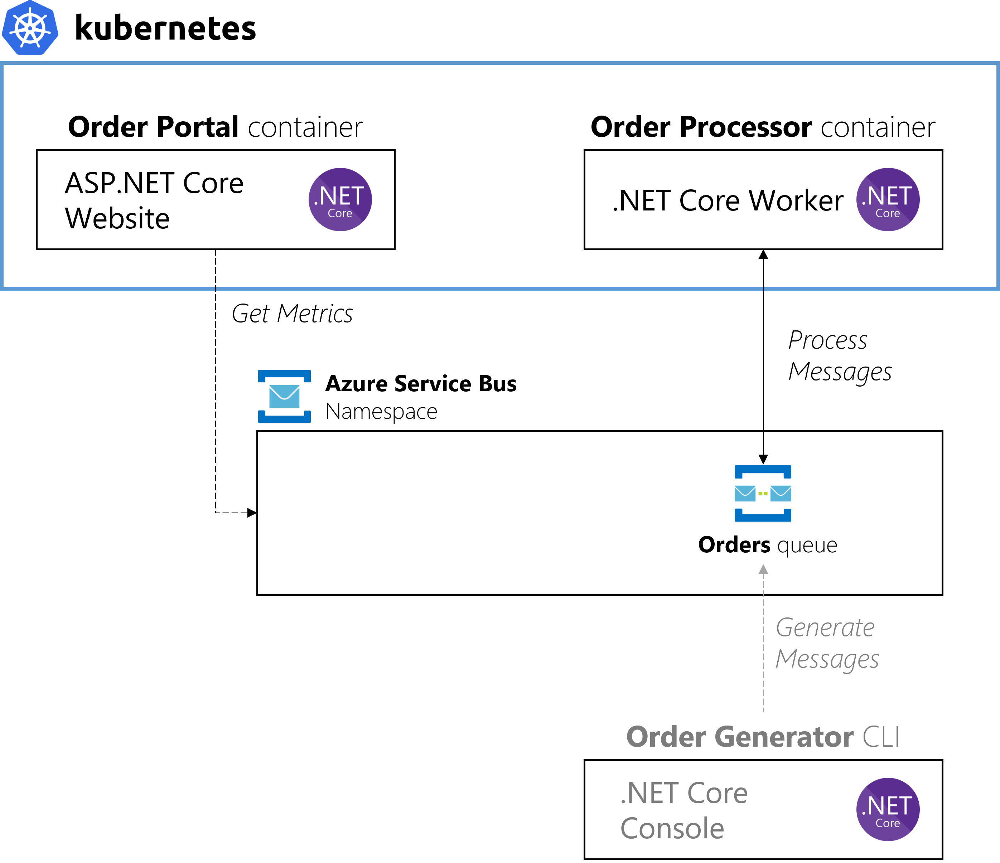

# .NET Core worker processing Azure Service Bus Queue scaled by KEDA
A simple Docker container written in .NET that will receive messages from a Service Bus queue and scale via KEDA.

The message processor will receive a single message at a time (per instance), and sleep for 2 second to simulate performing work. When adding a massive amount of queue messages, KEDA will drive the container to scale out according to the event source (Service Bus Queue).

We provide samples for the following scenarios:

- [**Process Azure Service Bus Queue by using Azure AD Pod Identity**](pod-identity.md)
- [**Process Azure Service Bus Queue by using connection string authentication**](connection-string-scenario.md)

> 💡 *If you want to learn how to scale this sample with KEDA 1.0, feel free to read about it [here](https://github.com/kedacore/sample-dotnet-worker-servicebus-queue/tree/keda-v1.0).*
