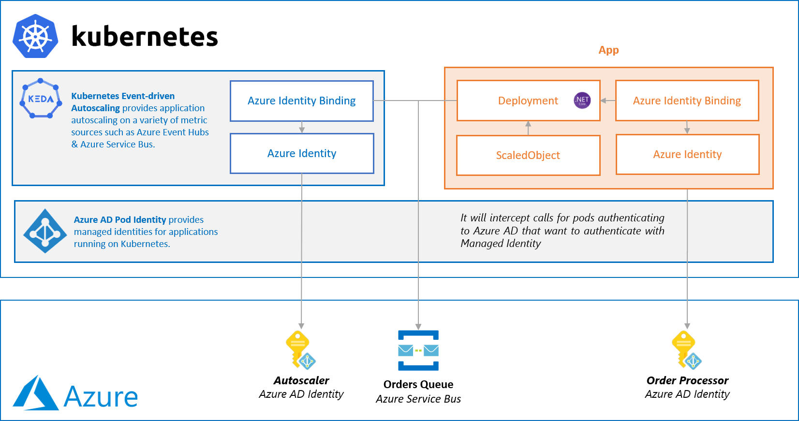

# .NET Core worker processing Azure Service Bus Queue scaled by KEDA with Azure AD Pod Identity
A simple Docker container written in .NET that will receive messages from a Service Bus queue and scale via KEDA with Azure AD Pod Identity.



> 💡 *If you want to learn how to scale this sample with KEDA 1.0, feel free to read about it [here](https://github.com/kedacore/sample-dotnet-worker-servicebus-queue/tree/keda-v1.0).*

_The sample can also be ran locally on Docker without KEDA, read our [documentation here](./src/)._

## A closer look at our KEDA Scaling

This is defined via the `ScaledObject` which is deployed along with our application.

```yaml
apiVersion: keda.sh/v1alpha1
kind: ScaledObject
metadata:
  name: order-processor-scaler
  labels:
    app: order-processor
    name: order-processor
spec:
  scaleTargetRef:
    name: order-processor
  # minReplicaCount: 0 Change to define how many minimum replicas you want
  maxReplicaCount: 10
  triggers:
  - type: azure-servicebus
    metadata:
      namespace: keda-demos
      queueName: orders
      queueLength: '5'
    authenticationRef:
      name: trigger-auth-service-bus-orders
```

It defines the type of scale trigger we'd like to use, in our case `azure-servicebus`, and the scaling criteria. For our scenario we'd like to scale out if there are 5 or more messages in the `orders` queue in the `keda-demos` namespace with a maximum of 10 concurrent replicas which is defined via `maxReplicaCount`.

Next to that, it is referring to `trigger-auth-service-bus-orders` which is a `TriggerAuthentication` resource that defines how KEDA should authenticate to get the metrics:

```yaml
apiVersion: keda.sh/v1alpha1
kind: TriggerAuthentication
metadata:
  name: trigger-auth-service-bus-orders
spec:
  podIdentity:
    provider: azure
```

In this case, we are telling KEDA to use Azure as a pod identity provider. Under the hood, it will use [Azure AD Pod Identity](https://github.com/Azure/aad-pod-identity).

This allows us to not only re-use this authentication resource but also assign different permissions to KEDA than our app itself by assigning another Azure AD App to KEDA.

## Pre-requisites

- Azure CLI
- Azure Subscription
- .NET Core 3.0
- Kubernetes cluster [Azure AD Pod Identity](https://github.com/Azure/aad-pod-identity) installed

## Setup

This setup will go through creating an Azure Service Bus queue  and deploying this consumer with the `ScaledObject` to scale via KEDA.  If you already have an Azure Service Bus namespace you can use your existing queues.

## Creating Azure AD identities

We will first create two Azure AD identities:

- An identity for our application to authenticate with
- An identity for our KEDA to authenticate with

This can easily be done by using `az identity create` in the Azure CLI, for example:

```cli
az identity create --name <identity-name> --resource-group <resource-group-name>
{
  "clientId": "<identity-id>",
  "clientSecretUrl": "https://control-westeurope.identity.azure.net/subscriptions/<subscription-id>/resourcegroups/<resource-group-name>/providers/Microsoft.ManagedIdentity/userAssignedIdentities/<identity-name>/credentials?tid=<tenant-id>&oid=<redacted>&aid=<identity-id>",
  "id": "/subscriptions/<subscription-id>/resourcegroups/<resource-group-name>/providers/Microsoft.ManagedIdentity/userAssignedIdentities/<identity-name>",
  "location": "westeurope",
  "name": "<identity-name>",
  "principalId": "<redacted>",
  "resourceGroup": "<resource-group-name>",
  "tags": {},
  "tenantId": "<tenant-id>",
  "type": "Microsoft.ManagedIdentity/userAssignedIdentities"
}
```

Make sure to create an app identities & autoscaler identity for which you need to copy the following information:

- `clientId` - Represents the unique id of the identity
- `id` - Represents the resource id of the identity

### Creating a new Azure Service Bus namespace & queue

We will start by creating a new Azure Service Bus namespace:

```cli
❯ az servicebus namespace create --name <namespace-name> --resource-group <resource-group-name> --sku basic
```

After that, we create an `orders` queue in our namespace:

```cli
❯ az servicebus queue create --namespace-name <namespace-name> --name orders --resource-group <resource-group-name>
```

Next, we need to grant our identities to be able to authenticate to Azure Service Bus.

```cli
❯ az servicebus queue create --namespace-name <namespace-name> --name orders --resource-group <resource-group-name>
```

Now that we have an Azure Service Bus namespace we can grant our app identity Azure Service Bus Data Receiver` role to our namespace so that it can process messages:

```cli
❯ az role assignment create --role 'Azure Service Bus Data Receiver' --assignee <app-identity-id> --scope /subscriptions/<subscription-id>/resourceGroups/<resource-group-name>/providers/Microsoft.ServiceBus/namespaces/<namespace-name>
```

## Deploying our order processor

We will start by creating a new Kubernetes namespace to run our order processor in:

```cli
❯ kubectl create namespace keda-dotnet-sample
namespace "keda-dotnet-sample" created
```

First, we need to update our `deploy-app-with-managed-identity.yaml` which will create our Kubernetes deployment along with the authentication information for Azure AD Pod Identity.

This includes the following resources:

- [`AzureIdentity`](https://azure.github.io/aad-pod-identity/docs/concepts/azureidentity/) which represents our application identity in Azure
- [`AzureIdentityBinding`](https://azure.github.io/aad-pod-identity/docs/concepts/azureidentitybinding/) which binds our AzureIdentity to our Kubernetes deployment

Before we can deploy our app, we need to replace the placeholders in  `deploy-app-with-managed-identity.yaml` with the values for your application identity.

Once that is done, we can now easily deploy our application to Kubernetes:

```cli
❯ kubectl apply -f deploy/managed-identity/deploy-app-with-managed-identity.yaml --namespace keda-dotnet-sample
azureidentity.aadpodidentity.k8s.io/<app-identity-name> created
azureidentitybinding.aadpodidentity.k8s.io/<app-identity-name>-binding created
deployment.apps/order-processor created
```

You will see that our deployment shows up with one pods created:

```cli
❯ kubectl get deployments --namespace keda-dotnet-sample -o wide
NAME              DESIRED   CURRENT   UP-TO-DATE   AVAILABLE   AGE       CONTAINERS        IMAGES                                                   SELECTOR
order-processor   1         1         1           1           49s       order-processor   kedasamples/sample-dotnet-worker-servicebus-queue   app=order-processor
```

## Installing KEDA

Before we can install KEDA, we need to create an `AzureIdentity` & `AzureIdentityBinding` for our it and similar to our application identity setup.

Replace the placeholders in `deploy-autoscaling-infrastructure.yaml` with the identity for the autoscaler and deploy it:

```cli
❯ kubectl apply -f deploy/managed-identity/deploy-autoscaling-infrastructure.yaml --namespace keda-dotnet-sample
azureidentity.aadpodidentity.k8s.io/<autoscaler-identity-name> created
azureidentitybinding.aadpodidentity.k8s.io/<autoscaler-identity-name>-binding created
```

With that in place, we can [install KEDA v2.0+](https://keda.sh/docs/2.0/deploy/) with Helm.

First, add the KEDA Helm repo and update it:

```cli
> helm repo add kedacore https://kedacore.github.io/charts
> helm repo update
```

Next, we'll create a namespace for KEDA and install the Helm chart where we specify our autoscaler identity id:

```cli
kubectl create namespace keda-system
helm install keda kedacore/keda --set podIdentity.activeDirectory.identity=<autoscaler-identity-id> --namespace keda-system
```

We're ready to scale our app!

## Deploying our autoscaling

First things first, we will grant the Azure AD identity for KEDA required permissions on our Azure Service Bus namespace to be able to query the metrics.

We will assign `Azure Service Bus Data Receiver` role to our autoscaler identity given it needs more control for monitoring our namespace:

```cli
❯ az role assignment create --role 'Azure Service Bus Data Owner' --assignee <scaler-identity-id> --scope /subscriptions/<subscription-id>/resourceGroups/<resource-group-name>/providers/Microsoft.ServiceBus/namespaces/<namespace-name>
```

Now that we have our Azure AD identity configured, we can use the identity in a `TriggerAuthentication` as following:

```yaml
apiVersion: keda.sh/v1alpha1
kind: TriggerAuthentication
metadata:
  name: trigger-auth-service-bus-orders
spec:
  podIdentity:
    provider: azure
```

This tells KEDA to authenticate to Azure Service Bus by using Managed Identity, which will be using Azure AD Pod Identity, to be able to query the metrics. With that KEDA can scale our app based on our defined `ScaledObject` - We are ready to go!

Now let's create everything:

```cli
❯ kubectl apply -f .\deploy\deploy-app-autoscaling.yaml --namespace keda-dotnet-sample
triggerauthentication.keda.sh/trigger-auth-service-bus-orders created
scaledobject.keda.sh/order-scaler created
```

Once created, you will see that our deployment shows up with no pods created:

```cli
❯ kubectl get deployments --namespace keda-dotnet-sample -o wide
NAME              DESIRED   CURRENT   UP-TO-DATE   AVAILABLE   AGE       CONTAINERS        IMAGES                                                   SELECTOR
order-processor   0         0         0            0           49s       order-processor   kedasamples/sample-dotnet-worker-servicebus-queue   app=order-processor
```

This is because our queue is empty and KEDA scaled it down until there is work to do.

In that case, let's give generate some!

## Publishing messages to the queue

The following job will send messages to the "orders" queue on which the order processor is listening to. As the queue builds up, KEDA will help the horizontal pod autoscaler add more and more pods until the queue is drained. The order generator will allow you to specify how many messages you want to queue.

First you should clone the project:

```cli
❯ git clone https://github.com/kedacore/sample-dotnet-worker-servicebus-queue
❯ cd sample-dotnet-worker-servicebus-queue
```

Configure a connection string with `Send` permissions in the tool via your favorite text editor, in this case via Visual Studio Code:

```cli
❯ code .\src\Keda.Samples.Dotnet.OrderGenerator\Program.cs
```

Next, you can run the order generator via the CLI:

```cli
❯ dotnet run --project .\src\Keda.Samples.Dotnet.OrderGenerator\Keda.Samples.Dotnet.OrderGenerator.csproj
Let's queue some orders, how many do you want?
300
Queuing order 719a7b19-f1f7-4f46-a543-8da9bfaf843d - A Hat for Reilly Davis
Queuing order 5c3a954c-c356-4cc9-b1d8-e31cd2c04a5a - A Salad for Savanna Rowe
[...]

That's it, see you later!
```

Now that the messages are generated, you'll see that KEDA starts automatically scaling out your deployment:

```cli
❯ kubectl get deployments --namespace keda-dotnet-sample -o wide
NAME              DESIRED   CURRENT   UP-TO-DATE   AVAILABLE   AGE       CONTAINERS        IMAGES                                                   SELECTOR
order-processor   8         8         8            4           4m        order-processor   kedasamples/sample-dotnet-worker-servicebus-queue   app=order-processor
```

Eventually we will have 10 pods running processing messages in parallel:

```cli
❯ kubectl get pods --namespace keda-dotnet-sample
NAME                              READY     STATUS    RESTARTS   AGE
order-processor-65d5dd564-9wbph   1/1       Running   0          54s
order-processor-65d5dd564-czlqb   1/1       Running   0          39s
order-processor-65d5dd564-h2l5l   1/1       Running   0          54s
order-processor-65d5dd564-h6fcl   1/1       Running   0          24s
order-processor-65d5dd564-httnf   1/1       Running   0          1m
order-processor-65d5dd564-j64wq   1/1       Running   0          54s
order-processor-65d5dd564-ncwfd   1/1       Running   0          39s
order-processor-65d5dd564-q7tkt   1/1       Running   0          39s
order-processor-65d5dd564-t2g6x   1/1       Running   0          24s
order-processor-65d5dd564-v79x6   1/1       Running   0          39s
```

You can look at the logs for a given processor as following:

```cli
❯ kubectl logs order-processor-65d5dd564-httnf --namespace keda-dotnet-sample
info: Keda.Samples.Dotnet.OrderProcessor.OrdersQueueProcessor[0]
      Starting message pump at: 06/03/2019 12:32:14 +00:00
info: Keda.Samples.Dotnet.OrderProcessor.OrdersQueueProcessor[0]
      Message pump started at: 06/03/2019 12:32:14 +00:00
info: Microsoft.Hosting.Lifetime[0]
      Application started. Press Ctrl+C to shut down.
info: Microsoft.Hosting.Lifetime[0]
      Hosting environment: Production
info: Microsoft.Hosting.Lifetime[0]
      Content root path: /app
info: Keda.Samples.Dotnet.OrderProcessor.OrdersQueueProcessor[0]
      Received message 513b896fbe3b4085ad274d9c23e01842 with body {"Id":"7ff54254-a370-4697-8115-134e55ebdc65","Amount":1741776525,"ArticleNumber":"Chicken","Customer":{"FirstName":"Myrtis","LastName":"Balistreri"}}
info: Keda.Samples.Dotnet.OrderProcessor.OrdersQueueProcessor[0]
      Processing order 7ff54254-a370-4697-8115-134e55ebdc65 for 1741776525 units of Chicken bought by Myrtis Balistreri at: 06/03/2019 12:32:15 +00:00
info: Keda.Samples.Dotnet.OrderProcessor.OrdersQueueProcessor[0]
      Order 7ff54254-a370-4697-8115-134e55ebdc65 processed at: 06/03/2019 12:32:17 +00:00
info: Keda.Samples.Dotnet.OrderProcessor.OrdersQueueProcessor[0]
      Message 513b896fbe3b4085ad274d9c23e01842 processed at: 06/03/2019 12:32:17 +00:00
info: Keda.Samples.Dotnet.OrderProcessor.OrdersQueueProcessor[0]
      Received message 9d24f13cd5ec44e884efdc9ed4a8842d with body {"Id":"cd9fe9e4-f421-432d-9b19-b94dbf9090f5","Amount":-186606051,"ArticleNumber":"Shoes","Customer":{"FirstName":"Valerie","LastName":"Schaefer"}}
info: Keda.Samples.Dotnet.OrderProcessor.OrdersQueueProcessor[0]
      Processing order cd9fe9e4-f421-432d-9b19-b94dbf9090f5 for -186606051 units of Shoes bought by Valerie Schaefer at: 06/03/2019 12:32:17 +00:00
info: Keda.Samples.Dotnet.OrderProcessor.OrdersQueueProcessor[0]
      Order cd9fe9e4-f421-432d-9b19-b94dbf9090f5 processed at: 06/03/2019 12:32:19 +00:00
info: Keda.Samples.Dotnet.OrderProcessor.OrdersQueueProcessor[0]
      Message 9d24f13cd5ec44e884efdc9ed4a8842d processed at: 06/03/2019 12:32:19 +00:00
```

## Visualizing the service bus queue

There is also a web application included in the repository that shows a simple bar chart with the number of messages. The graph refreshes every 2 seconds, giving you a visualization how the queue initially builds up when orders are being sent to the service bus, and then when the autoscaler kicks in the queue will decrease in length quicker and quicker depending on how many replicas that have been created.


To build and run the web app locally, add the service bus connection string to appSettings.json and run the web application from Visual Studio.

There is also a docker image available, so you can also run it locally with the following command:

```cli
docker run -p 8080:80 -d -e OrderQueue__ConnectionString="KEDA_SERVICEBUS_QUEUE_CONNECTIONSTRING" kedasamples/sample-dotnet-web 
```

To deploy the web application to your Kubernetes cluster:

```cli
❯ kubectl apply -f .\deploy\deploy-web.yaml --namespace keda-dotnet-sample
deployment.apps/order-web created
service/kedasampleweb created
```

Get the public IP by running:

```cli
❯ kubectl get svc kedasampleweb --namespace keda-dotnet-sample
NAME            TYPE           CLUSTER-IP   EXTERNAL-IP     PORT(S)        AGE
kedasampleweb   LoadBalancer   10.0.37.60   52.157.87.179   80:30919/TCP   117s
```

You'll need to wait a short while until the public IP is created and shown in the output. 


## Cleaning up resources

### Delete the application

```cli
❯ kubectl delete -f deploy/managed-identity/deploy-autoscaling-infrastructure.yaml --namespace keda-dotnet-sample
❯ kubectl delete -f deploy/managed-identity/deploy-app-with-managed-identity.yaml --namespace keda-dotnet-sample
❯ kubectl delete -f deploy/managed-identity/deploy-app-autoscaling.yaml --namespace keda-dotnet-sample
❯ kubectl delete namespace keda-dotnet-sample
```

### Delete the Azure Service Bus namespace

```cli
❯ az servicebus namespace delete --name <namespace-name> --resource-group <resource-group-name>
```

### Delete the Azure identities

```cli
❯ az identity delete --name <scaler-identity-name> --resource-group <resource-group>
❯ az identity delete --name <app-identity-name> --resource-group <resource-group>
```

### Uninstall KEDA

```cli
❯ helm delete --purge keda
❯ kubectl delete customresourcedefinition  scaledobjects.keda.sh
❯ kubectl delete customresourcedefinition  triggerauthentications.keda.sh
❯ kubectl delete namespace keda
```
